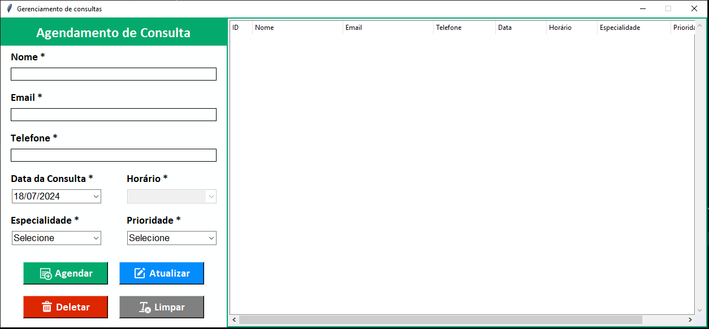

<h1 align="center" id="titulo">Appointment manager</h1>

<p align="center" id="badges">


</p>

## Índice 
* [Descrição do projeto](#descrição-do-projeto)
* [Layout da aplicação](#layout-da-aplicação)
* [Acesso ao projeto](#acesso-ao-projeto)
* [Tecnologias utilizadas](#tecnologias-utilizadas)
* [Licença](#licença)

## Descrição do projeto
<p align="justify">
Este projeto é uma aplicação de gerenciamento de consultas médicas. A aplicação permite o agendamento, atualização, exclusão e visualização de consultas agendadas, com funcionalidades adicionais para validação de dados e controle de horários disponíveis.
</p>

## Layout da aplicação

<p align="center">
    
</p>

## Acesso ao projeto

Siga as etapas abaixo:
1. No terminal, clone o projeto:
    ```
    git clone https://github.com/Emmanuelly-Silva/appointment-manager.git
    ```

2. Mude para o diretório do projeto clonado:
    ```
    cd appointment-manager
    ```

3. Crie um ambiente virtual para isolar as dependências do projeto:
    ```
    python -m venv venv
    ```

4. Ative o ambiente virtual:
    - No Windows:
        ```
        venv\Scripts\activate
        ```
    - No macOS e Linux:
        ```
        source venv/bin/activate
        ```
5. Instale as dependências do projeto:
    ```
    pip install -r requirements.txt
    ```

6. Rode os comandos iniciais:
    ```
    python db_setup.py
    python main.py
    ```

## Tecnologias utilizadas
<p>


</p>

## Licença

The [MIT License](LICENSE) (MIT)

Copyright :copyright: 2024 - Appointment manager
